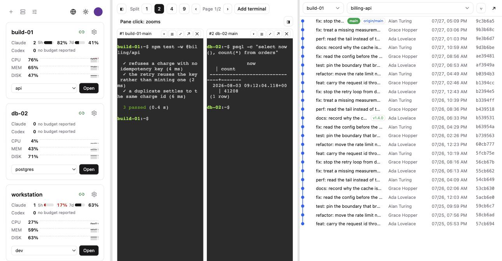

# pdmux

Codex, Claude 같은 AI CLI를 여러 개 동시에 돌릴 때, 그 터미널들을 한 브라우저에서 같이 보면서 작업하기
위한 셀프호스트 대시보드입니다.

[English README](README.md)



## 왜 만들었나

AI CLI에 일을 시켜 놓고 기다리는 시간이 깁니다. 그래서 자연스럽게 여러 개를 동시에 돌리게 되는데,
여기서부터 불편해집니다.

터미널 프로그램은 기본적으로 한 번에 하나를 보여줍니다. 여러 개를 같이 보려면 tmux나 터미널 분할을
직접 구성해야 하고, 창을 옮겨 다니면서 어느 창이 무슨 작업이었는지 기억해야 합니다. 작업이 늘어날수록
그 설정과 기억이 부담이 됩니다.

**브라우저에서 여러 개를 한눈에 보고, 필요할 때만 그 화면으로 들어가서 처리하고 싶었습니다.** 이것이
pdmux를 만든 출발점입니다.

여기에 실제로 돌려보면서 필요해진 것들을 붙였습니다.

- **자원 모니터링** — AI CLI를 여러 개 돌리면 개발 PC의 CPU·메모리·스왑·디스크가 먼저 한계에 닿습니다.
  터미널만 보고 있으면 왜 갑자기 느려졌는지 알 수 없어서, 호스트 상태를 같은 화면에 뒀습니다.
- **토큰 잔량** — 작업이 멈추는 흔한 이유가 토큰 소진입니다. Codex와 Claude의 남은 사용량을 카드에
  같이 표시해서, 다 쓰기 전에 알 수 있게 했습니다.
- **git 변경사항** — AI CLI가 만든 결과물은 결국 커밋입니다. 무엇이 바뀌었는지, 브랜치별로 어디까지
  머지됐는지를 같은 브라우저에서 확인하려고 읽기 전용 커밋 그래프를 넣었습니다.

한 대에서 쓰려고 만들었지만, 여러 대를 쓰게 되어도 방식은 같습니다. 호스트를 추가하면 카드가 하나 늘고,
터미널 분할에서 그 호스트를 고를 수 있게 됩니다.

## 무엇을 볼 수 있나

**터미널** — 탭 또는 2·4·9 분할로 배치합니다. 각 pane마다 호스트와 세션을 따로 고르므로, 한 화면에서
서로 다른 작업을 동시에 볼 수 있습니다. 헤더를 끌어서 자리를 바꾸고, 하나를 확대해서 잠깐 집중했다가
다시 돌아올 수 있습니다.

세션은 호스트의 멀티플렉서(tmux)에 살아 있습니다. 브라우저를 닫아도 AI CLI는 계속 돌고, 다시 열면 그
세션에 그대로 붙습니다. 분할 배치와 어느 pane이 어느 세션이었는지는 계정에 저장되므로 다른 컴퓨터에서
열어도 같은 화면입니다.

**호스트 카드** — CPU·메모리·스왑·디스크의 현재값과 최근 추세를 스파크라인으로 보여줍니다. 측정에 실패하면
0이 아니라 `—`로 표시합니다. 0으로 적으면 "정상인데 한가함"으로 읽히기 때문입니다.

**토큰 잔량** — provider별로 남은 사용량을 창(예: 5시간, 7일) 단위로 보여줍니다. 제공자마다 남은 양을
주기도 하고 쓴 양을 주기도 하는데, 카드는 항상 남은 양을 그립니다. 보고되지 않는 창은 빈 게이지를
그리지 않고 아예 표시하지 않습니다.

**커밋 그래프** — 브랜치·태그·미커밋 변경을 보고, 커밋을 클릭하면 그때 diff를 받아옵니다. 오른쪽 패널은
로컬·원격·태그를 나눠서 보여주고 브랜치마다 `↑n ↓n`으로 앞뒤 차이를 적습니다. 갈라진 브랜치가 위로
올라오고, 업스트림이 사라진 브랜치는 배지로 따로 표시합니다.

수집기는 **읽기 전용**입니다. `fetch`·`gc`·`checkout`이 코드에 아예 없고, 모든 git 호출에
`GIT_OPTIONAL_LOCKS=0`을 붙여서 `git status`조차 인덱스를 건드리지 않습니다. 작업 중인 체크아웃을
망가뜨리지 않는 것이 전제이기 때문입니다. 대신 원격 브랜치는 마지막 fetch 기준이고, 화면에도 그렇게
적혀 있습니다.

**서비스 바로가기** — 호스트가 띄운 서비스(포트·프로브 방식·URL)를 등록해 두면 카드에서 바로 열 수
있습니다. 에이전트가 하트비트마다 프로브해서 살아 있는지 표시합니다.

## 동작 방식

```
브라우저 ──── HTTPS / WebSocket ────▶ pdmux ◀──── WebSocket (아웃바운드) ──── 에이전트 (호스트마다 1개)
                                       │
                                       ├─ PostgreSQL   호스트·서비스·레이아웃·지표·커밋 메타
                                       ├─ Redis        세션·pub/sub·레이트리밋·작업 큐
                                       └─ S3 / MinIO   커밋 패치 본문
```

각 호스트에는 에이전트가 하나 뜹니다. 정적 Go 바이너리 하나이고, 서버로 **나가는** 웹소켓 하나를 열어서
그 위로 전부 처리합니다. 하트비트, PTY, git 스냅샷, 서비스 프로브까지 같은 연결을 씁니다.

방향이 이렇게 된 이유는 실용적입니다. 서버가 호스트로 들어가는 구조였다면 같은 네트워크, SSH 키 배포,
인바운드 포트가 전부 전제가 됩니다. 나가는 연결 하나만 있으면 사무실 데스크톱이든 집 노트북이든 클라우드
VM이든 똑같이 붙습니다. NAT 뒤에 있어도 상관없습니다.

터미널도 같은 연결을 씁니다. 에이전트가 호스트에서 PTY를 열고, 서버가 웹소켓을 중계하고, 브라우저는
**동일 출처**에서 xterm.js를 그립니다. 별도의 터미널 서버나 터널이 필요 없고, 복사·붙여넣기·키 매핑이
전부 우리 코드 안에 들어옵니다.

수집 주기·git 루트·프로브 대상 같은 설정은 서버가 갖고 있습니다. 저장하면 접속 중인 에이전트에게 바로
내려가므로, 설정을 고치려고 호스트에 다시 들어갈 일이 없습니다.

에이전트 자체를 새 버전으로 바꾸는 것도 대시보드에서 합니다. 여기서 막아야 할 실패는 하나입니다.
**서버에 접속하지 못하는 빌드가 설치되는 것.** 그렇게 되면 되돌릴 버튼이 방금 사라진 호스트의 화면 위에
있게 됩니다. 그래서 교체 전에 도는 에이전트가 새 바이너리를 직접 실행해 실제 핸드셰이크까지 시켜 보고,
교체한 뒤에도 유예 기간 안에 접속하지 못하면 스스로 이전 바이너리로 되돌립니다. 자세한 내용은
[docs/ARCHITECTURE.md](docs/ARCHITECTURE.md) §2-1에 있습니다.

## 설치하기

전부 이미 만들어진 이미지라, 그 머신에는 Docker 말고 필요한 것이 없습니다. Node도 Go도, 이 저장소도
필요 없습니다. `linux/amd64`와 `linux/arm64` 둘 다 발행하므로 애플 실리콘이나 Graviton 인스턴스도 자기
아키텍처의 이미지를 그대로 받습니다.

```bash
base=https://raw.githubusercontent.com/podosoft-dev/pdmux/main/infra/docker
curl -fsSLO "$base/selfhost.compose.yml"
curl -fsSL  "$base/selfhost.env.example" -o .env
$EDITOR .env        # 도메인, 본인 이메일, 그리고 파일이 요구하는 비밀값 네 개
docker compose -f selfhost.compose.yml --env-file .env up -d
```

`https://<도메인>`을 열고 가입합니다. **`ADMIN_EMAILS`에 적어 둔 주소로 가입해야 합니다** — 그것이
관리자가 되는 조건이고, 다른 주소로 가입하면 일반 사용자가 되는데 화면에는 그 이유가 나오지 않습니다.
HTTPS는 취향이 아닙니다. 세션 쿠키와 에이전트 토큰이 그 위로 오가고, 호스트가 실행할 설치 명령에는
게이트웨이가 알려 준 오리진이 그대로 박힙니다. 그래서 compose 파일에 Caddy가 함께 들어 있고, 인증서는
알아서 받아 갱신합니다.

보존 정책·백업, 또는 이 게이트웨이 대신 쓰던 것을 앞에 두는 방법은
[docs/OPERATIONS.md](docs/OPERATIONS.md) §1에 있습니다.

업그레이드할 때는 `.env`의 `PDMUX_VERSION`을 새 릴리스로 고정하고 이미지를 pull한 뒤, 일회성
마이그레이션이 끝나야 애플리케이션 컨테이너가 전환되도록 해야 합니다. 기존 계정이 있는 설치는
`0.11.0`을 건너뛰고 `0.11.1` 이상을 사용하세요. 자세한 절차는
[업그레이드 안내](docs/OPERATIONS.md#1-2-upgrading-published-images)에 있습니다.

## 호스트 추가하기

UI에서 호스트를 추가하면 등록 코드가 박힌 설치 명령이 그대로 나옵니다.

```bash
curl -fsSL https://<pdmux 주소>/install.sh | sh -s -- --code pdmxe_XXXXX-XXXXX-XXXXX-XXXXX
```

대상 머신에 미리 깔아 둘 것은 없습니다. 런타임도 컴파일러도 필요 없습니다. 등록 코드는 1회용이고 15분
뒤에 만료되며, 장기 토큰은 바이너리 안에서 교환해 0600 파일로 바로 쓰기 때문에 셸 히스토리나 `ps`에
남지 않습니다. `--user`를 붙이면 root 없이 per-user 서비스로 깔리고, 외부망이 막힌 머신은 토큰을
발급해서 설치합니다([docs/OPERATIONS.md](docs/OPERATIONS.md) §2-4).

호스트에 tmux가 깔려 있으면 세션 목록이 바로 잡힙니다. 없으면 세션 대상 대신 일반 셸만 열 수 있고,
카드에 그 사실이 표시됩니다.

### 머신 없이 화면만 보고 싶을 때

`tools/demo-agent.mjs`가 에이전트 쪽 프로토콜을 대신 말해 줍니다. 호스트가 하나도 없어도 대시보드를
채울 수 있습니다. 이 저장소를 받아 둔 자리에서 돌아갑니다. UI에서 호스트를 만들고 상세 화면에서 토큰을
발급한 뒤 실행합니다.

```bash
bun tools/demo-agent.mjs --server https://<pdmux 주소> --token pdmux_… --profile build
bun tools/demo-agent.mjs --list-profiles     # build · db · laptop
```

위 스크린샷도 이렇게 찍었습니다. 편의를 위한 도구이지 테스트 더블은 아닙니다. 두 구현을 같은 계약에
묶는 것은 `packages/protocol/conformance`입니다.

## AI CLI를 pdmux에 붙이기

AI CLI가 MCP로 pdmux를 다룰 수 있습니다 — 호스트 상태를 읽고, 명령을 돌리고, 기기를 등록하는 것까지
저장소를 열지 않고 됩니다. 자격증명은 두 종류이고, 차이는 어디까지 닿느냐입니다.

**호스트 키**는 호스트 상세 화면에서 발급하고 그 기기 하나에만 닿습니다. 그 모드에서는 어떤 도구도
호스트 id를 인자로 받지 않으므로 다른 기기를 지목할 방법이 없습니다.

**계정 토큰**은 **Coding CLI 접근** 화면에서 발급하고, 볼 수 있는 모든 호스트에 세 등급 중 하나로
닿습니다: 읽기 전용, 운영(호스트 등록·에이전트 업데이트·명령 실행), 관리자(호스트 삭제·여러 대 일괄 업데이트). 만료되고,
폐기할 수 있고, 바꾼 것은 전부 감사 로그에 남습니다.

```
Codex   codex mcp add pdmux --url <origin>/mcp --bearer-token-env-var PDMUX_MCP_TOKEN
Claude  {"mcpServers":{"pdmux":{"type":"http","url":"<origin>/mcp",
          "headers":{"Authorization":"Bearer ${PDMUX_MCP_TOKEN}"}}}}
```

**둘 다 다른 자격증명을 만들지 못합니다.** 두 번 읽을 만한 문장입니다 — 자격증명을 만들 수 있는
자격증명은 한 번의 유출을 원본을 폐기해도 닫히지 않는 발판으로 바꿉니다. 복사되는 설정에는 평문이 아니라
환경변수 이름이 들어갑니다. 설정 블록은 저장소에 커밋되기 쉬운 자리이기 때문입니다.

### pdmux는 호스트에 접속하지 않습니다

에이전트가 나가고, 들어오는 것은 없습니다. 호스트의 `address`는 운영자 참고용일 뿐이고 — pdmux가 그리로
연결을 여는 일은 없습니다. 그래서 기기에서 **실행되어야 하는** 것은 이 도구들이 명령을 건네주고 AI가
자기 ssh로 실행합니다. 닿을 수 없으면 사용자에게 묻습니다. pdmux는 ssh 자격증명을 갖지 않고, 갖게 되면
이 아키텍처가 딛고 선 성질이 사라집니다.

그래서 "호스트를 추가하고 에이전트를 설치해줘"는 한 단계가 아니라 세 단계입니다.

```
1. host_create { label: "build-01", address: "build-01.internal" }
      → 호스트와, 15분 뒤 만료되는 1회용 설치 명령
2. AI가 자기 셸에서 실행:
      ssh <대상> 'curl -fsSL <origin>/install.sh | PDMUX_CODE=pdmxe_… sh -s -- --user'
3. host_detail { hostId }  → 몇 초 뒤 online: true
```

3번은 생략할 수 없습니다. 설치 스크립트는 에이전트의 첫 핸드셰이크 **전에** 끝나므로 종료 코드 0이
접속됐다는 뜻이 아닙니다. 도구 전체 목록, 파괴적 작업의 확인 절차, 오류 코드는
[docs/MCP.md](docs/MCP.md)에 있습니다.

## 저장소 구조

| | |
|---|---|
| `apps/api` | Bun 기반 Elysia + TypeORM(PostgreSQL). 호스트 레지스트리, 에이전트 게이트웨이, 지표 보존, git 저장, 개인화 |
| `apps/web` | SvelteKit + Tailwind v4 + shadcn-svelte. 대시보드와 관리자 화면 |
| `agent` | 호스트에서 도는 Go 데몬. PTY·리소스·세션·서비스 프로브·읽기 전용 git. Bun 워크스페이스가 아닙니다 |
| `packages/protocol` | 에이전트↔서버 계약(zod). 앱은 이 파일을 직접 쓰고, 에이전트는 여기서 생성한 JSON Schema를 embed합니다 |
| `packages/core` | 프레임워크 없는 로직. 터미널 그리드 상태, 게이지, 스파크라인, 커밋 레인 배치 |
| `packages/ui` | Svelte 5 컴포넌트. 따로 배포할 수 있습니다 |

`@pdmux/ui`와 `@pdmux/core`는 이 앱 밖에서도 쓸 수 있게 만들었습니다. 데이터는 props로 들어가고 동작은
콜백으로 나오며 문구는 쓰는 쪽이 주입합니다. 계약은 [docs/COMPONENTS.md](docs/COMPONENTS.md)에 있습니다.

## 개발

pdmux를 고칠 때는 운영 이미지를 쓰지 않습니다. 두 Bun 앱은 watch 모드로 돌고 의존 서비스만
컨테이너에 두므로, 고친 것이 운영 빌드 없이 화면에 반영됩니다.

```bash
bun install
cp .env.example .env
docker compose --env-file .env \
  -f infra/docker/docker-compose.yml -f infra/docker/minio.compose.yml -p pdmux \
  up -d postgres redis minio minio-init
bunx @better-auth/cli migrate -y --config apps/api/src/auth/auth.ts
bun run --cwd apps/api migration:run
bun run dev
```

web `5001`, api `5002`, Postgres `5440`, Redis `6390`, MinIO `9010`(콘솔 `9011`)입니다. 포트가 겹치면
`.env`에서 바꿉니다. 이것이 왜 개발 경로일 뿐 제품을 서비스하는 방법이 아닌지는
[docs/OPERATIONS.md](docs/OPERATIONS.md) §1-1에 적어 두었습니다.

```bash
bun run lint                # 두 앱과 패키지 타입 체크
bun run test                # 워크스페이스 단위 테스트
cd agent && go test ./...   # 에이전트는 Go 모듈이라 Bun 워크스페이스에 들어가지 않습니다
bun run test:e2e            # Playwright. 스택이 떠 있어야 합니다
bun run build:agent         # linux·darwin × amd64·arm64. Go 툴체인이 필요해서
                            # `bun run build`에는 일부러 넣지 않았습니다
```

UI 테스트는 DOM만 보지 않고 **기하**를 잽니다. 목록이 실제로 스크롤 컨테이너인지, 클릭한 패널이 뷰포트
안에 있는지, 페이지 자체는 밀리지 않는지를 확인합니다. "클릭해도 아무 일도 안 난다"는 같은 버그를 세 번
고치는 동안 DOM 질의는 매번 "내용은 있다"고 답했기 때문입니다
([docs/ARCHITECTURE.md](docs/ARCHITECTURE.md) §7).

## 문서

문서는 영어로 씁니다. 한국어로 병기하는 것은 이 README 하나입니다.

| | |
|---|---|
| [ARCHITECTURE.md](docs/ARCHITECTURE.md) | 왜 pull이 아니라 push인지, 터미널을 동일 출처로 만든 이유, 읽기 전용 git을 구조로 강제하는 법, UI를 기하로 검증하는 이유 |
| [MCP.md](docs/MCP.md) | 자격증명 두 종류, `hostId`가 왜 인자가 됐고 무엇이 그 보장을 대신하는지, 파괴적 도구가 왜 실행 전에 설명하는지 |
| [CONTRACTS.md](docs/CONTRACTS.md) | 에이전트↔서버 프로토콜. 봉투, 등록, 원격 업데이트, 그리고 추가만 허용하는 규칙 |
| [OPERATIONS.md](docs/OPERATIONS.md) | 배포, 에이전트 온보딩, 보존, 백업과 복구, 증상별 대처표 |
| [AGENT_GO.md](docs/AGENT_GO.md) | 에이전트 구조, 생성물과 손으로 쓴 것의 구분, `go generate` 절차 |
| [VERSIONING.md](docs/VERSIONING.md) | 두 개의 SemVer가 따로 움직이는 이유, `PROTOCOL_VERSION`, 이를 지키는 CI 검사 |
| [COMPONENTS.md](docs/COMPONENTS.md) | `@pdmux/ui`의 props와 이벤트, 스타일 경계가 어디인지 |
| [USAGE-COLLECTION.md](docs/USAGE-COLLECTION.md) | CLI를 실행하지 않고 토큰 사용량을 읽는 법, 형식이 바뀌었을 때 다시 찾는 절차 |
| [IME_INPUT.md](docs/IME_INPUT.md) | 모바일 조합 입력(한글·일본어·중국어)과 지원하지 않는 범위 |

이 저장소에서 코드를 쓸 때의 규칙은 [AGENTS.md](AGENTS.md)에 있습니다. 사람과 AI CLI 모두 대상입니다.

## 라이선스

Apache-2.0. [LICENSE](LICENSE)를 참고하시면 됩니다.
